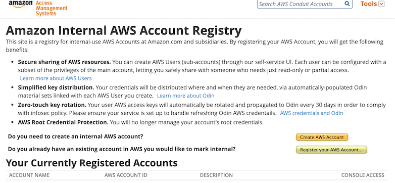
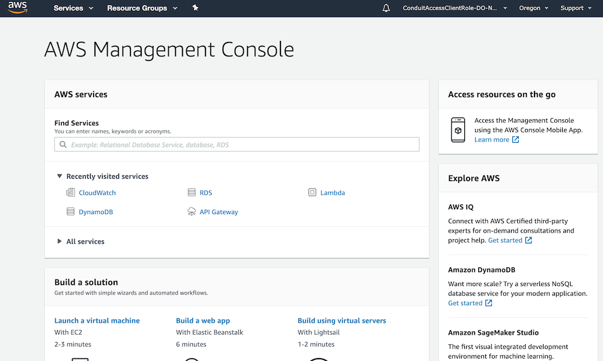
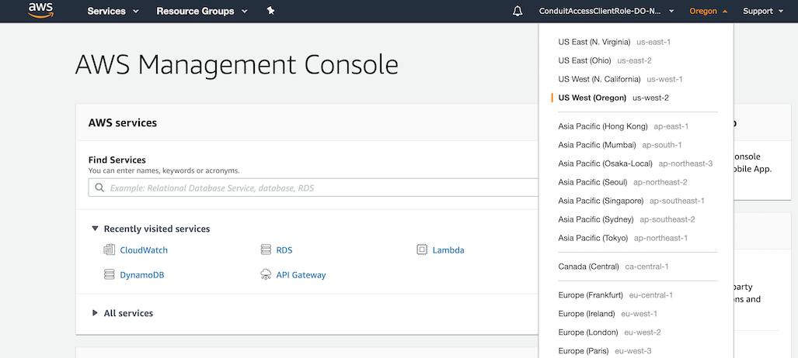
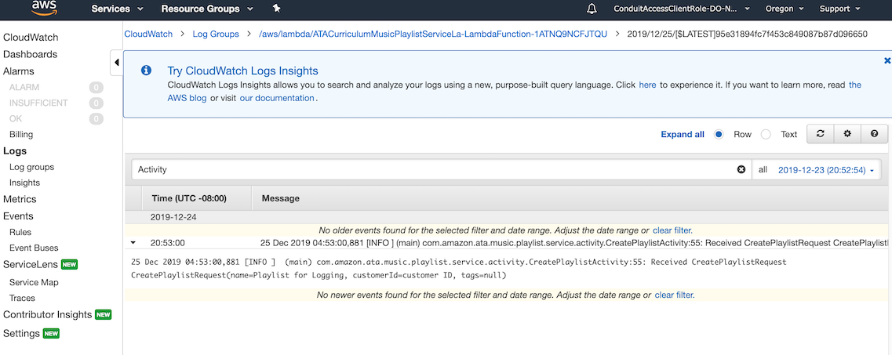

## Mastery Task 2: That Cloud Looks Like a Log

**Unlocks after:**

* Milestone 1+: Lesson 1, *Remote Debugging and Logging*  		  
  		  
### Milestone 1: View RDE logs
**Reviewer: ATA-Unit2-Instructor-Reviewers**

Your task is to make our service easier to debug by adding logging. Add code to the `findShipmentOption()` 
method in the `ShipmentService` class to log the method's inputs. Remember, if you do not implement a `toString()`
method for a class, the default `toString()` is used when printing an object and the object's memory location will be 
printed. For example, without a `toString()` method implemented in the `FulfillmentCenter` class, a `FulfillmentCenter` 
object might print out as: `FulfillmentCenter@13518f37`. That's not very helpful. Ideally we would print something like:
`FulfillmentCenter: fcCode=IND1`.

Note: you will also need to create a `Logger` in the `ShipmentService` class.

Next, we'll validate that our new log statement appears in our log file. We'll need to call our service so our new 
log statement gets executed. Update your `mounts/events/prepare_shipment.json` to have the following contents:
```
{
  "queryStringParameters": {
    "fcCode": "IND1",
    "itemAsin": "0132350882",
    "itemDescription": "Clean Code",
    "itemLength": "7.0",
    "itemWidth": "1.2",
    "itemHeight": "9.2"
}
```

Make a request to your service with the above inputs using the same `rde` workflow used in PPT01: 
`rde wflow run invoke-prepare-shipment`.

Navigate to your project package on the command line and connect to the local docker container running your lambda. You 
can do this by running `rde stack exec <Alias>ATACurriculumSustainabilityShipmentServiceLambda bash`. This command 
will start a new shell instance in our docker environment.

You should see a new command prompt similar to the one below

`[deceneu@dev-dsk-<alias>>-1a-111a11aa logs]$`

Navigate to the logs directory at `/home/deceneu/logs/`. There should be a log file named `api-gateway.log`, you can 
view the contents using the `less` command, or `grep` for a keyword that can help identify the log line you've added.

Create a new file in the `resources` folder named `mastery-task2-local.txt`. Paste the entire log line from 
`api-gateway.log` into your new file. The line should include the time stamp, log level, class and line the log 
statement was sent from, and message. Here is an example:

```
28 Jun 2020 19:20:03,151 [WARN ]  (main) com.amazon.ata.service.ATAService:101: This is an example log statement.
```

You can go exit the docker container with either of the following commands:
* type `exit` and press enter in the terminal
* press `ctrl+d` on your keyboard

If you run the `tct-task2-local` workflow and it passes, put out a CR to the `ATA-Unit2-Instructor-Reviewers` 
team that includes your changes to add logging to `ShipmentService` and the results of your local log search. The title 
of your commit and CR must begin with `[MT02][Local]`. These changes will need to be pushed and deployed to the beta 
stage of your pipeline in order to complete the next milestone.

&nbsp;

## Milestone 2: View CloudWatch logs 
**Reviewer: ATA-Unit2-Instructor-Reviewers**

Once you have pushed your commit and it has reached the beta stage in your project pipeline, the TCTs will
execute and call your deployed service. After that, you can follow the steps below to view your new logs in AWS 
CloudWatch.

To do so, we'll have to login to to your AWS account. An AWS account is used to own and track the use of AWS resources 
and services. At Amazon, we use a tool called Conduit to manage our AWS accounts. 

Optional: If you’d like to dive in a little deeper on Conduit and what it’s doing, you can take this [15-minute 
wiki-based course introducing Conduit](https://w.amazon.com/bin/view/EE/Learn/AWS/Introduction_Conduit/). Conduit is 
used by all non-AWS employees, AWS employees use another tool called Isengard.

Go to [https://access.amazon.com/aws/accounts](https://access.amazon.com/aws/accounts), to view the Conduit AWS accounts
you have access to. You should see the following header on the page:



Now look for your Unit 2 account, called `<Alias>ATAUnit2`. Click the button labeled "Console Access" next to your AWS 
account entry, this will log you in as a pre-configured user inside this AWS account and give you access to the 
resources inside the account.

You should now see the AWS Management Console:

 

The AWS Management Console is the landing page and allows users to search for or navigate to specific AWS resources.

AWS services are often regionalized, meaning there are different versions deployed to different regions across the 
world. This means a failure in one region will not affect another’s performance, and users in other parts of the world 
can choose a region close to their physical location to reduce the communication time with AWS services. It’s important 
to verify that you are looking at the `us-west-2` region because that's the region we'll be running our AWS services. 
We pick it because it’s the closest region location-wise to Seattle so our communication between our service and AWS is 
faster.

Go ahead and double check you are looking at the `us-west-2` region of AWS by making sure the selected region says 
"Oregon" in the console navigation bar, or switch to it using the region switcher by clicking the selected region.



Search for "CloudWatch" and select "CloudWatch" to go to the AWS CloudWatch console. AWS CloudWatch is a service that 
allows AWS customers to view logs from their deployed applications. We’ve viewed them locally while running our service 
through RDE, but often issues will appear in deployed services, so it’s important to be able to view logs in a central 
place. CloudWatch creates "Log groups" where we can view our service logs in "Log Streams", based on when the line was 
logged. On the left side panel, select "Log groups" and click on the log group with the naming format below:
```
/aws/lambda/ATACurriculumSustainabilityShipment-LambdaFunction-<RANDOM-STRING>
```

The page you end up on should be a list of Log Streams sorted by Last Event Time. Select the first Log Stream to view 
the latest events.


When viewing a log stream, you can provide a filter to only show events matching certain criteria. The MT01 TCT calls 
your service with an item with ASIN: `3141592`, so use the filter "3141592" to find the log statement where the 
inputs to the `findShipmentOption()` method include `3141592`. This is similar to using `grep` to search for a specific 
text snippet in the logs.  

Here's an example of filtering by the term "Activity"



If the latest Log Stream does not have it, you might have to look at an earlier one, based on the *Last Event Time* 
column. The time of the event will match up with when your TCTs were last run. You can check your pipeline to see 
when they were run. Look right below where it says 'Project Completion Approval'.

You can now always come back and check the CloudWatch logs in order to debug TCTs in your pipeline!

Create another file in the `resources` folder named `mastery-task2-cloudwatch.txt`, paste the log line that appears 
in the CloudWatch console for the ASIN `3141592`. If there is more than one, you can choose any of the lines that 
appear.

If you run the `tct-task2-cloudwatch` workflow and it passes, put out a CR to the `ATA-Unit2-Instructor-Reviewers` 
team. The title of your commit and CR must begin with `[MT02][CloudWatch]`.

**Exit Checklist**
- `rde wflow run tct-task2` passes
- Your CR adding logging to your service has been approved and the code pushed
- You can access your Unit 2 AWS account
- You can view your logs in the CloudWatch console
- Your CR documenting your CloudWatch findings has been approved and the code pushed
